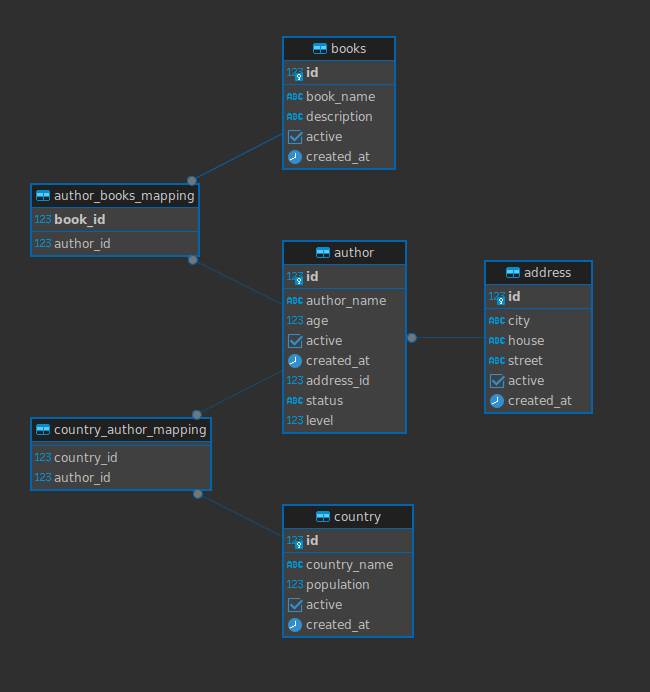

# Commons-Dao Sample

This is a sample repository that offers a simplified implementation of
the [smartsensesolutions-commons-dao](https://github.com/smartSenseSolutions/smartsense-java-commons) repository.
The sample repository includes implementations for Books and Authors, showcasing how
the [smartsensesolutions-commons-dao](https://github.com/smartSenseSolutions/smartsense-java-commons) can facilitate the
search functionality.

Entity Relationship Diagram:


By utilizing the specification utils provided, it becomes effortless to implement pagination, sorting and filtering with
different type of conditional operators and create various types of queries by just passing the parameters.

## 3 Easy steps for integration

1) Add dependency

   Here we use Gradle as the build tool and for that we used below dependency with in our build.gradle file.

    ```groovy
    implementation group: 'com.smartsensesolutions', name: 'commons-dao', version: '1.0.0'
    ```

2) Add Component Scan of `com.smartsensesolutions` Or create bean of `SpecificationUtil`

    ```java
    
    @SpringBootApplication(scanBasePackages = {"com.smartsensesolutions", "com.smartsensesolutions.java.commons.dao.sample"})
    public class CommonsDaoSampleApplication {
    
        public static void main(String[] args) {
            SpringApplication.run(CommonsDaoSampleApplication.class, args);
        }
    }
    ```

3) Extends common's base Types

   Each `Entity`, `Repository` and `Service` class must be extended with the `BaseEntity`, `BaseRepository`
   and `BaseService` respectively from the above-mentioned packages.

## How to use Provided Function

Once You extend your Entity service class with 'BaseService' you will get 'Page<E> filter(FilterRequest filter)' method
in inheritance from the 'BaseService' along with many other useful methods like get, create, count with filter, etc.

### Get understanding of FilterRequest

This the request you need to pass to filter dynamically
there are six properties in it.

Table: [FilterRequest](https://github.com/smartSenseSolutions/smartsense-java-commons/blob/master/commons-dao/src/main/java/com/smartsensesolutions/java/commons/FilterRequest.java)
Description

| Property         | Type             | Description                                                                                                                                                                                                                         | 
|------------------|------------------|-------------------------------------------------------------------------------------------------------------------------------------------------------------------------------------------------------------------------------------|
| page             | int              | Which page you want to retrieve, it starts with 0, **0 means first page**                                                                                                                                                           |
| size             | int              | How many rows you want retrieve in page, You can pass `Integer.MAX_VALUE` with `page=0` to get all record                                                                                                                           |
| criteriaOperator | CriteriaOperator | All the criteria will joined with this [logical operator](https://github.com/smartSenseSolutions/smartsense-java-commons/blob/master/commons-dao/src/main/java/com/smartsensesolutions/java/commons/criteria/CriteriaOperator.java) |
| sort             | `List<Sort>`     | It is and array field for order by                                                                                                                                                                                                  |
| criteria         | `List<Criteria>` | List of condition joined with `criteriaOperator` or in special case with `And` Operator                                                                                                                                             |
| orCriteria       | `List<Criteria>` | List of condition with `Or` Operator                                                                                                                                                                                                |

Table: [Sort](https://github.com/smartSenseSolutions/smartsense-java-commons/blob/master/commons-dao/src/main/java/com/smartsensesolutions/java/commons/sort/Sort.java)
Description

| Property | Type     | Description                                                                                                                                                                                         | 
|----------|----------|-----------------------------------------------------------------------------------------------------------------------------------------------------------------------------------------------------|
| column   | String   | Column name on which you want to sort                                                                                                                                                               |
| sortType | SortType | On which [direction](https://github.com/smartSenseSolutions/smartsense-java-commons/blob/master/commons-dao/src/main/java/com/smartsensesolutions/java/commons/sort/SortType.java) you want to sort |

Table: [Criteria](https://github.com/smartSenseSolutions/smartsense-java-commons/blob/master/commons-dao/src/main/java/com/smartsensesolutions/java/commons/filter/FilterCriteria.java)
Description

| Property | Type           | Description                                                                                                                                                                              | 
|----------|----------------|------------------------------------------------------------------------------------------------------------------------------------------------------------------------------------------|
| column   | String         | Column name on which you want filter, This field hase some separator like '.' separates join table entity ',' separates two field if condition in the two fields                         |
| operator | Operator       | Conditional [Operator](https://github.com/smartSenseSolutions/smartsense-java-commons/blob/master/commons-dao/src/main/java/com/smartsensesolutions/java/commons/operator/Operator.java) |
| values   | `List<String>` | List of value for the condition, in some case it will take first value in list if operator don't support multiple value for some it will not take any value at all                       |

### Supported Operators

Table: [Operator](https://github.com/smartSenseSolutions/smartsense-java-commons/blob/master/commons-dao/src/main/java/com/smartsensesolutions/java/commons/operator/Operator.java)
Description

| Operator                  | Supported Value   | Description                                                                                                                                                                                                                                                                                 | 
|---------------------------|-------------------|---------------------------------------------------------------------------------------------------------------------------------------------------------------------------------------------------------------------------------------------------------------------------------------------|
| CONTAIN                   | Multiple Value    | It will search from fields by converting it to string and case insensitively, it supports multiple value and join it with or operator, enum will also supported if it is stored with String value liek `@Enumerated(EnumType.STRING)`. SQL Wildcard character will be escaped before search |
| CONTAIN_WITH_WILDCARD     | Multiple Value    | Same as `CONTAIN` but it will accept **like supported SQL pattern**                                                                                                                                                                                                                         |
| NOT_CONTAIN               | Multiple Value    | Same as `CONTAIN` operator with `NOT` logical operation                                                                                                                                                                                                                                     |
| NOT_CONTAIN_WITH_WILDCARD | Multiple Value    | Same as `NOT_CONTAIN` but it will accept **like supported SQL pattern**                                                                                                                                                                                                                     |
| EQUALS                    | Single Value      | It is an implementation of `=` operator of SQL, make sure you pass appropriate datatype as par the field in string form same goes for enum too                                                                                                                                              |
| NOT_EQUAL                 | Single Value      | Same as `EQUALS` operator with `NOT` logical operation                                                                                                                                                                                                                                      |
| IN                        | Multiple Value    | It is an implementation of `in` operator, data type sensitiv                                                                                                                                                                                                                                |
| NOT_IN                    | Multiple Value    | Same as `IN` operator with `NOT` logical operation                                                                                                                                                                                                                                          |
| GREATER_THAN              | Single Value      | It is an implementation of `>` operator, data type sensitiv, Works with enum if you stored it as a number like `@Enumerated(EnumType.ORDINAL)`, works for `Date` too                                                                                                                        |
| LESSER_THAN               | Single Value      | It is an implementation of `<` operator, data type support will be same as `GREATER_THAN`                                                                                                                                                                                                   |
| GREATER_EQUALS            | Single Value      | Same as `GREATER_THAN`, Inclusive for current value                                                                                                                                                                                                                                         |
| LESSER_EQUALS             | Single Value      | Same as `LESSER_THAN`, Inclusive for current value                                                                                                                                                                                                                                          |
| TRUE                      | No value Required | Implementation of `is true` SQL operator, Only works for boolean data type return                                                                                                                                                                                                           |
| FALSE                     | No value Required | Implementation of `is false` SQL operator, Only works for boolean data type return                                                                                                                                                                                                          |
| NULL                      | No value Required | Implementation of `is null` SQL operator, Will check for null values                                                                                                                                                                                                                        |
| NOT_NULL                  | No value Required | Implementation of `is not null` SQL operator, Will check for non null values                                                                                                                                                                                                                |

### How to pass value

| Type     | Example            | Description                                                                       | 
|----------|--------------------|-----------------------------------------------------------------------------------|
| `String` | "Street no-5"      | Any Character string. Number, Alphabet and Symbol                                 |
| Pattern  | "_a%"              | Valid pattern for `like` SQL operator                                             |
| `Number` | "153"<br>"12.6"    | Any Number or fractional number as a String                                       |
| `Date`   | "1708414144205"    | `Long` timestamp as String                                                        |
| `eunm`   | "OnLine"<br>"Away" | Name of this enum constant as String. It should match with entity field data type |

## Sample Project Description

This project contains several endpoints which can provide a mechanism to save the data and search those data based on
the common-dao package.

Note: Data creation is not necessary as this project automatically creates the table and generate sample data in
database directly by just passing the DB connection configuration

You can see all the endpoints with [Open API](http://localhost:8080/ui/swagger-ui/index.html#) after
running the Application. Host might be different as par your deployment

1. Create new data

    ```sh
    curl --location '::8080/create/books' \
    --header 'Content-Type: application/json' \
    --data '[
        {
            "authorName": "AuthorName",
            "age": 25,
            "books": [
                {
                    "bookName": "Spring Automation 2022",
                    "description": "Basic Automation setup from Zero to Hero with SpringBoot 2025."
                }
            ]
        }
    ]'
    ```

2. Search APIs
    1. Get Paginated response of author.

       Request Example
        ```sh
        curl -X 'POST' \
        'http://localhost:8080/author/search' \
        -H 'accept: */*' \
        -H 'Content-Type: application/json' \
        -d '{"page":0,"size":5}'
        ```
       It will give data of author in the page of 5 records

       Request Body
        ```json
        {
            "page": 0,
            "size": 5
        }
        ```

       Underlying query will look like
        ```sql
        SELECT * FROM author offset 0 limit 5;
        ```

    2. Get Paginated and Sorted Response of author

       Request Body
        ```json
        {
            "page": 0,
            "size": 10,
            "sort": [
                {
                    "column": "age",
                    "sortType": "ASC"
                },
                {
                    "column": "authorName",
                    "sortType": "DESC"
                }
            ]
        }
        ```
       Underlying query will look like
        ```sql
        SELECT * FROM author order by age asc, author_name desc offset 0 limit 5;
        ```

    3. Search author by the author name.
        ```json
        {
            "page": 0,
            "size": 5,
            "criteria": [
                {
                    "column": "authorName",
                    "operator": "EQUALS",
                    "values": [
                        "Ziemer Miller"
                    ]
                }
            ]
        }
        ```
       Underlying query will look like
        ```sql
        SELECT * FROM author where author_name = 'Ziemer Miller' offset 0 limit 5;
        ```

    4. Search author who is not active
       Don't pass ant value for `FALSE` Operator.
        ```json
        {
        	"page": 0,
        	"size": 5,
        	"criteria": [
        		{
        			"column": "active",
        			"operator": "FALSE"
        		}
        	]
        }
        ```
       Underlying query will look like
        ```sql
        SELECT * FROM author where active is false offset 0 limit 5;
        ```

    5. Search author with **or** `criteriaOperator'
        ```json
        {
            "page": 0,
            "size": 5,
            "criteriaOperator": "OR",
            "criteria": [
                {
                    "column": "authorName",
                    "operator": "EQUALS",
                    "values": [
                        "Ziemer Miller"
                    ]
                },
                {
                    "column": "id",
                    "operator": "EQUALS",
                    "values": [
                        "1"
                    ]
                }
            ]
        }
        ```
       Underlying query will look like
        ```sql
        SELECT * FROM author where author_name = 'Ziemer Miller' or id = 1 offset 0 limit 5;
        ```
       Note: Default value for `criteriaOperator` will be `AND`

    6. Search author where author name contains `z`.
        ```json
        {
            "page": 0,
            "size": 5,
            "criteria": [
                {
                    "column": "authorName",
                    "operator": "CONTAIN",
                    "values": [
                        "z"
                    ]
                }
            ]
        }
        ```
       Underlying query will look like
        ```sql
        SELECT * FROM author where author_name like '%z%' offset 0 limit 5;
        ```

    7. Search author by sub entity Address (In join Table)
        ```json
        {
            "page": 0,
            "size": 5,
            "criteria": [
                {
                    "column": "address.city",
                    "operator": "IN",
                    "values": [
                        "Surat","Gandhinagar"
                    ]
                }
            ]
        }
        ```
       Underlying query will look like:
        ```sql
        SELECT * FROM author a 
        join address ad on a.address_id = ad.id  
        where ad.city in ('Surat','Gandhinagar')
        offset 0 limit 5;
        ```

    8. Search author by city or street field (Use same join for two fields)
       If you want to use same join on multiple field then you can pass field `,` separated like:
        ```json
        {
            "page": 0,
            "size": 5,
            "criteria": [
                {
                    "column": "address.city,street",
                    "operator": "CONTAIN",
                    "values": [
                        "str"
                    ]
                }
            ]
        }
        ```
       It will search for `"str"` from city **or** street

       Underlying query will look like:
        ```sql
        SELECT * FROM author a
        join address ad on a.address_id = ad.id  
        where ad.city like '%str%' or ad.street like '%str%'
        offset 0 limit 5
        ```

       Note: You can use `,` separated fields even without join like:
        ```json
        {
            "column": "id,addressId",
            "operator": "EQUALS",
            "values": [
                "1"
            ]
        }
        ```
       It will generate query like where condition like:
        ```sql
        SELECT * FROM author
        where id = 1 or address_id = 1
        ...;
        ```

    9. Search Country of Author of Book
       Join can go to any number of sub object each table will be separated by `.`.

       Author don't have three level of nested object. So, we will take an example of Country entity.

       Request Example
        ```sh
        curl -X 'POST' \
        'http://localhost:8080/country/search' \
        -H 'accept: */*' \
        -H 'Content-Type: application/json' \
        -d '{"page":0,"size":5,"criteria":[{"column":"authors.books.bookName","operator":"CONTAIN","values":["java"]}]}'
        ```

       Request Body
        ```json
        {
        	"page": 0,
        	"size": 5,
        	"criteria": [
        		{
        			"column": "authors.books.bookName",
        			"operator": "CONTAIN",
        			"values": [
        				"java"
        			]
        		}
        	]
        }
        ```

    10. Combine `And` and `Or` criteria On Author
        ```json
        {
        	"page": 0,
        	"size": 5,
        	"sort": [
        		{
        			"column": "id",
        			"sortType": "ASC"
        		}
        	],
        	"criteriaOperator": "AND",
        	"criteria": [
        		{
        			"column": "status",
        			"operator": "IN",
        			"values": [
        				"OnLine",
        				"NoCall",
        				"DND"
        			]
        		},
        		{
        			"column": "level",
        			"operator": "IN",
        			"values": [
        				"Beginner",
        				"Intermediate",
        				"Expert"
        			]
        		}
        	],
        	"orCriteria": [
        		{
        			"column": "books.bookName",
        			"operator": "CONTAIN",
        			"values": [
        				"java"
        			]
        		},
        		{
        			"column": "address.street",
        			"operator": "CONTAIN",
        			"values": [
        				"5"
        			]
        		}
        	]
        }
        ```
        Note: here in this case where we pass `criteria` and `orCriteria`. So, all the elements in `criteria` list will
        be logicaly joind with `AND` Operator, all the elements in `orCriteria` will be logically joined by `OR`
        Operator and value in the `criteriaOperator` will be used to join `criteria` and `orCriteria`.

        Pseudocode for where condition is like:

        ```sql
        select * from author where 
            (status in ("OnLine", "NoCall", "DND") and level in ("Beginner", "Intermediate", "Expert"))
        and
            (books.bookName like "%java%" or address.street like "%5%")
        ...;
        ```